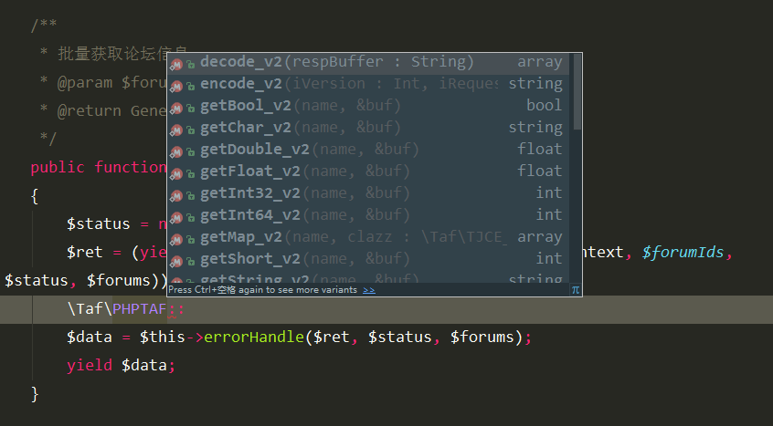
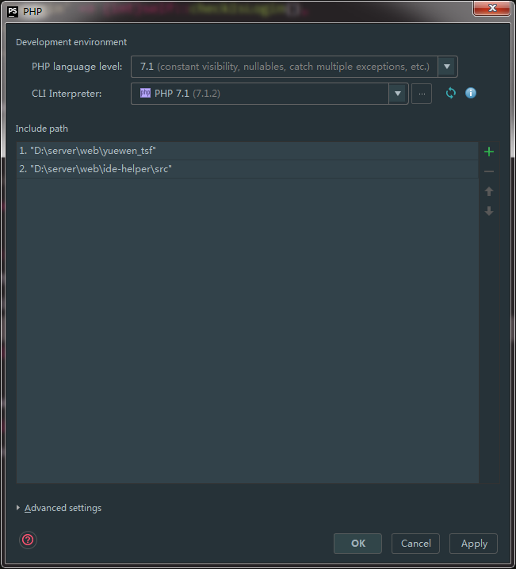

phptaf-ide-helper
====================

phptaf在IDE下自动识别类、函数，自动补全函数名

## 使用方式
### composer 安装：

    composer require --dev "copyrenzhe/phptaf-ide-helper:dev-master"

### 普通IDE：

使用 IDE自带 ``Include Path`` 功能引入 src 目录

### PHPStorm 使用演示

